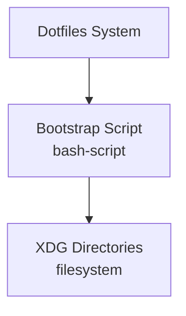

# Grounded C4 Architecture System - Implementation Tasks

**Epic:** Integrate Architecture Modeling with OpenSpec
**Status:** Planning
**Start Date:** 2026-02-11

---

## Epic Description

Extend OpenSpec to include architectural modeling using the Grounded C4 approach. This will enable:
- Modeling system architecture with concrete resources (not abstract C4 containers)
- Progressive zoom from landscape → domain → service → interface
- Behavioral modeling with sequences and state machines
- Traceability from specs → architecture → implementation
- Reverse engineering to extract architecture from codebases

---

## Phase 1: Core Modeling (MVP)

### Task 1.1: Define YAML Schemas

**Priority:** P0 (Blocking)
**Estimate:** 2 days

**Description:**
Create JSON schemas for validating architecture models.

**Acceptance Criteria:**
- [ ] Resource schema defined (`schemas/resource.schema.json`)
  - id, name, type, technology, description
  - abstract flag
  - children (nested resources)
  - interfaces (protocol, direction, metadata)
  - tags, metadata (extensible)
- [ ] Relationship schema defined (`schemas/relationship.schema.json`)
  - from/to (InterfaceRef or ResourceRef)
  - via (intermediate resource)
  - description, tags, metadata
- [ ] Validation rules documented
  - Unique IDs within scope
  - Referential integrity (from/to resolve)
  - Abstract resources must have children
- [ ] Schema tests (valid/invalid examples)

**Files:**
- `share/arch/schemas/resource.schema.json`
- `share/arch/schemas/relationship.schema.json`
- `share/arch/schemas/interface.schema.json`
- `tests/arch/test_schemas.py`

---

### Task 1.2: Implement `arch` CLI Skeleton

**Priority:** P0 (Blocking)
**Estimate:** 1 day
**Depends On:** None

**Description:**
Create the basic CLI tool structure following the pattern of `openspec` and `spec`.

**Acceptance Criteria:**
- [ ] Python script at `local/bin/arch`
- [ ] Executable with proper shebang
- [ ] Argument parsing (subcommands)
- [ ] Commands implemented:
  - `arch --help` - Show help
  - `arch --version` - Show version
  - `arch list` - List resources (stub)
  - `arch validate` - Validate models (stub)
- [ ] Colorized output (using rich or colorama)
- [ ] Error handling with clear messages

**Files:**
- `local/bin/arch`
- `local/lib/arch/__init__.py`
- `local/lib/arch/cli.py`

---

### Task 1.3: Implement Model Loading

**Priority:** P0 (Blocking)
**Estimate:** 2 days
**Depends On:** Task 1.1

**Description:**
Load and parse YAML architecture models with schema validation.

**Acceptance Criteria:**
- [ ] Load single YAML file
- [ ] Load directory of YAML fragments
- [ ] Validate against JSON schemas
- [ ] Build in-memory model (resource tree)
- [ ] Resolve resource paths (dotted notation)
- [ ] Handle errors gracefully (invalid YAML, schema violations)
- [ ] Unit tests (valid/invalid models)

**Files:**
- `local/lib/arch/loader.py`
- `local/lib/arch/model.py`
- `tests/arch/test_loader.py`
- `tests/arch/fixtures/valid/`
- `tests/arch/fixtures/invalid/`

---

### Task 1.4: Implement Referential Integrity Validation

**Priority:** P0 (Blocking)
**Estimate:** 2 days
**Depends On:** Task 1.3

**Description:**
Validate that all references (relationships, interfaces) resolve to actual resources.

**Acceptance Criteria:**
- [ ] Check relationship from/to references
- [ ] Check sequence from/to references
- [ ] Check state machine resource anchors
- [ ] Report errors with helpful context (file, line, path)
- [ ] Warning for orphan interfaces (not used)
- [ ] Unit tests (valid/invalid references)

**Files:**
- `local/lib/arch/validator.py`
- `tests/arch/test_validator.py`

---

### Task 1.5: Implement `arch list` Command

**Priority:** P1
**Estimate:** 1 day
**Depends On:** Task 1.3

**Description:**
List all resources in the architecture model with metadata.

**Acceptance Criteria:**
- [ ] Show resources in tree structure
- [ ] Display id, name, type, technology
- [ ] Show abstract vs. concrete resources
- [ ] Show interface count per resource
- [ ] Colorized output (green=concrete, gray=abstract)
- [ ] Filter by type, tag, or query

**Files:**
- `local/lib/arch/commands/list.py`

---

### Task 1.6: Implement `arch validate` Command

**Priority:** P1
**Estimate:** 1 day
**Depends On:** Task 1.4

**Description:**
Validate architecture models and report issues.

**Acceptance Criteria:**
- [ ] Schema validation results
- [ ] Referential integrity results
- [ ] Summary (total resources, relationships, sequences)
- [ ] Error count with severity (error, warning)
- [ ] Exit code 0 (valid) or 1 (invalid)
- [ ] Colorized output (red=error, yellow=warning, green=ok)

**Files:**
- `local/lib/arch/commands/validate.py`

---

### Task 1.7: Generate Mermaid Diagrams

**Priority:** P1
**Estimate:** 3 days
**Depends On:** Task 1.3

**Description:**
Generate Mermaid C4 diagrams from architecture models.

**Acceptance Criteria:**
- [ ] Generate landscape view (top-level resources + external systems)
- [ ] Generate domain view (abstract groupings + concrete children)
- [ ] Generate service view (concrete resources + interfaces)
- [ ] Support zoom levels (filter by depth)
- [ ] Output to stdout or file
- [ ] Mermaid syntax validation

**Files:**
- `local/lib/arch/generators/mermaid.py`
- `tests/arch/test_mermaid.py`

**Example Output:**

---

### Task 1.8: Implement `arch diagram` Command

**Priority:** P1
**Estimate:** 1 day
**Depends On:** Task 1.7

**Description:**
CLI command to generate diagrams.

**Acceptance Criteria:**
- [ ] `arch diagram --format=mermaid` - Generate Mermaid
- [ ] `arch diagram --zoom=landscape` - Landscape view
- [ ] `arch diagram --zoom=domain` - Domain view
- [ ] `arch diagram --zoom=service` - Service view
- [ ] `arch diagram --output=file.md` - Write to file
- [ ] Preview in terminal (if glow available)

**Files:**
- `local/lib/arch/commands/diagram.py`

---

### Task 1.9: Create OpenSpec Specification

**Priority:** P0 (Blocking)
**Estimate:** 2 days
**Depends On:** None

**Description:**
Write the formal OpenSpec specification for the Grounded C4 system.

**Acceptance Criteria:**
- [ ] Spec file at `.openspec/specs/008-grounded-c4-architecture/spec.md`
- [ ] Frontmatter (Domain, Version, Status, Date)
- [ ] Overview (Philosophy, Key Capabilities)
- [ ] RFC 2119 Keywords section
- [ ] Requirements with scenarios:
  - Concrete resource modeling
  - Progressive zoom
  - Interface-based relationships
  - Behavioral modeling (sequences, state machines)
  - Referential integrity validation
  - Diagram generation
  - OpenSpec integration
  - Reverse engineering
- [ ] References (RFC 2119, C4, Ilograph)
- [ ] License/Copyright
- [ ] Validation passes (`spec validate`)

**Files:**
- `.openspec/specs/008-grounded-c4-architecture/spec.md`

---

### Task 1.10: Create Design Document

**Priority:** P1
**Estimate:** 2 days
**Depends On:** None

**Description:**
Write comprehensive design documentation explaining the system.

**Acceptance Criteria:**
- [ ] Document at `docs/grounded-c4.md`
- [ ] Comparison: C4 vs. Concrete vs. Grounded C4
- [ ] Running example (Resonance or Dotfiles)
- [ ] YAML schema reference
- [ ] Validation rules
- [ ] Integration with OpenSpec
- [ ] Tool usage examples
- [ ] Design principles
- [ ] References

**Files:**
- `docs/grounded-c4.md`

---

### Task 1.11: Model Dotfiles Architecture (Proof of Concept)

**Priority:** P1
**Estimate:** 3 days
**Depends On:** Task 1.3, Task 1.8

**Description:**
Create architecture model for the dotfiles system as proof-of-concept.

**Acceptance Criteria:**
- [ ] `architecture/landscape.yaml` - Top-level system
- [ ] `architecture/resources/core.yaml` - Bootstrap, XDG, brew
- [ ] `architecture/resources/tools.yaml` - spec, dot, openspec
- [ ] `architecture/resources/shell.yaml` - bash integration
- [ ] Relationships defined (bootstrap → xdg, brew → packages)
- [ ] Validate successfully (`arch validate`)
- [ ] Generate diagrams (`arch diagram`)
- [ ] Link to specs (update 001-dotfiles-core with arch references)

**Files:**
- `.openspec/architecture/landscape.yaml`
- `.openspec/architecture/resources/core.yaml`
- `.openspec/architecture/resources/tools.yaml`
- `.openspec/architecture/resources/shell.yaml`

---

### Task 1.12: Integration Tests

**Priority:** P1
**Estimate:** 2 days
**Depends On:** Task 1.6, Task 1.8, Task 1.11

**Description:**
End-to-end integration tests using the dotfiles architecture model.

**Acceptance Criteria:**
- [ ] Test loading multi-file models
- [ ] Test cross-file referential integrity
- [ ] Test diagram generation from real model
- [ ] Test validation with errors
- [ ] Test `arch list` output
- [ ] Test `arch validate` output
- [ ] Test `arch diagram` output

**Files:**
- `tests/arch/test_integration.py`

---

## Phase 2: Behavioral Modeling

### Task 2.1: Define Sequence Schema

**Priority:** P2
**Estimate:** 1 day
**Depends On:** Task 1.1

**Description:**
Create JSON schema for sequence definitions.

**Acceptance Criteria:**
- [ ] Sequence schema (`schemas/sequence.schema.json`)
  - id, name, description, trigger
  - steps (from, to, action, condition, note)
  - parallel and alt flows
- [ ] Validation rules
- [ ] Tests

**Files:**
- `share/arch/schemas/sequence.schema.json`

---

### Task 2.2: Define State Machine Schema

**Priority:** P2
**Estimate:** 1 day
**Depends On:** Task 1.1

**Description:**
Create JSON schema for state machine definitions.

**Acceptance Criteria:**
- [ ] State machine schema (`schemas/state-machine.schema.json`)
  - id, name, resource (anchor)
  - states (id, name, description)
  - transitions (from, to, trigger, guard, action, sequence)
- [ ] Validation rules
- [ ] Tests

**Files:**
- `share/arch/schemas/state-machine.schema.json`

---

### Task 2.3: Implement Sequence Loading and Validation

**Priority:** P2
**Estimate:** 2 days
**Depends On:** Task 2.1, Task 1.4

**Description:**
Load sequences and validate references to resources/interfaces.

**Acceptance Criteria:**
- [ ] Load sequence YAML files
- [ ] Validate schema
- [ ] Validate from/to references
- [ ] Link sequences to resources
- [ ] Tests

**Files:**
- `local/lib/arch/model.py` (extend)
- `local/lib/arch/validator.py` (extend)

---

### Task 2.4: Generate UML Sequence Diagrams

**Priority:** P2
**Estimate:** 2 days
**Depends On:** Task 2.3

**Description:**
Generate Mermaid sequence diagrams from sequence definitions.

**Acceptance Criteria:**
- [ ] Mermaid sequence diagram syntax
- [ ] Support parallel flows
- [ ] Support alternative flows
- [ ] Tests

**Files:**
- `local/lib/arch/generators/mermaid.py` (extend)

---

### Task 2.5: Generate State Machine Diagrams

**Priority:** P2
**Estimate:** 2 days
**Depends On:** Task 2.2

**Description:**
Generate Mermaid state diagrams from state machine definitions.

**Acceptance Criteria:**
- [ ] Mermaid state diagram syntax
- [ ] Show states and transitions
- [ ] Highlight initial state
- [ ] Tests

**Files:**
- `local/lib/arch/generators/mermaid.py` (extend)

---

### Task 2.6: Link Sequences to Spec Scenarios

**Priority:** P2
**Estimate:** 1 day
**Depends On:** Task 2.3

**Description:**
Enable specs to reference sequences in architecture.

**Acceptance Criteria:**
- [ ] Spec template updated with architecture section
- [ ] Example: link "Bootstrap Flow" scenario to sequence
- [ ] Documentation

**Files:**
- `share/spec/template.md` (extend)
- `docs/grounded-c4.md` (extend)

---

### Task 2.7: Model Dotfiles Sequences

**Priority:** P2
**Estimate:** 2 days
**Depends On:** Task 2.3

**Description:**
Create sequence definitions for key dotfiles flows.

**Acceptance Criteria:**
- [ ] `sequences/bootstrap-flow.yaml` - Full bootstrap process
- [ ] `sequences/package-install.yaml` - Homebrew package installation
- [ ] `sequences/topic-discovery.yaml` - Shell topic discovery
- [ ] Validate and generate diagrams

**Files:**
- `.openspec/architecture/sequences/bootstrap-flow.yaml`
- `.openspec/architecture/sequences/package-install.yaml`
- `.openspec/architecture/sequences/topic-discovery.yaml`

---

## Phase 3: Reverse Engineering

### Task 3.1: Extract Resources from Files

**Priority:** P2
**Estimate:** 3 days

**Description:**
Implement reverse engineering to extract resources from config files.

**Acceptance Criteria:**
- [ ] Extract from bash scripts (detect functions, interfaces)
- [ ] Extract from docker-compose.yml (services, volumes, networks)
- [ ] Extract from kubernetes manifests (pods, services, deployments)
- [ ] Extract from config files (detect paths, settings)
- [ ] Generate initial YAML models

**Files:**
- `local/lib/arch/reverse_engineer.py`
- `local/lib/arch/extractors/bash.py`
- `local/lib/arch/extractors/docker.py`
- `local/lib/arch/extractors/kubernetes.py`

---

### Task 3.2: Implement `arch reverse-engineer` Command

**Priority:** P2
**Estimate:** 1 day
**Depends On:** Task 3.1

**Description:**
CLI command to reverse engineer architecture from codebases.

**Acceptance Criteria:**
- [ ] `arch reverse-engineer --source=script/` - Extract from directory
- [ ] `arch reverse-engineer --format=docker-compose --file=docker-compose.yml`
- [ ] `arch reverse-engineer --output=architecture/` - Write to directory
- [ ] Interactive mode (confirm before writing)

**Files:**
- `local/lib/arch/commands/reverse_engineer.py`

---

### Task 3.3: Coverage Tracking

**Priority:** P2
**Estimate:** 2 days
**Depends On:** Task 3.1

**Description:**
Track coverage: which resources are documented vs. exist in code.

**Acceptance Criteria:**
- [ ] Scan codebase for resources (scripts, services, configs)
- [ ] Compare against architecture model
- [ ] Report: documented, undocumented, orphaned
- [ ] Colorized output

**Files:**
- `local/lib/arch/commands/coverage.py`

---

### Task 3.4: Implement `arch coverage` Command

**Priority:** P2
**Estimate:** 1 day
**Depends On:** Task 3.3

**Description:**
CLI command to check architecture coverage.

**Acceptance Criteria:**
- [ ] `arch coverage` - Show coverage report
- [ ] `arch coverage --source=script/` - Scan specific directory
- [ ] `arch coverage --format=table` - Table output
- [ ] `arch coverage --format=json` - JSON output

**Files:**
- `local/lib/arch/commands/coverage.py`

---

## Phase 4: Advanced Tooling

### Task 4.1: Interactive Architecture Browser

**Priority:** P3
**Estimate:** 3 days
**Depends On:** Task 1.5

**Description:**
fzf-based interactive browser for architecture (like `spec` for specs).

**Acceptance Criteria:**
- [ ] Browse resources hierarchically
- [ ] Preview resource details in fzf pane
- [ ] Show interfaces and relationships
- [ ] Jump to related resources
- [ ] Keyboard shortcuts (Ctrl-/: zoom, Ctrl-D/U: scroll)

**Files:**
- `local/lib/arch/commands/browse.py`

---

### Task 4.2: Dependency Visualization

**Priority:** P3
**Estimate:** 2 days
**Depends On:** Task 1.5

**Description:**
Visualize dependencies: what depends on this resource?

**Acceptance Criteria:**
- [ ] `arch deps <resource-id>` - Show direct dependencies
- [ ] `arch deps --upstream <resource-id>` - What depends on this
- [ ] `arch deps --downstream <resource-id>` - What does this depend on
- [ ] `arch deps --graph` - Generate dependency graph

**Files:**
- `local/lib/arch/commands/deps.py`

---

### Task 4.3: Impact Analysis

**Priority:** P3
**Estimate:** 2 days
**Depends On:** Task 4.2

**Description:**
Analyze impact of changes: if I change this resource, what's affected?

**Acceptance Criteria:**
- [ ] `arch impact <resource-id>` - Show impact radius
- [ ] Trace through relationships
- [ ] Show affected specs
- [ ] Show affected sequences

**Files:**
- `local/lib/arch/commands/impact.py`

---

### Task 4.4: ADR Integration

**Priority:** P3
**Estimate:** 1 day

**Description:**
Link ADRs to architecture resources.

**Acceptance Criteria:**
- [ ] ADRs can reference resource IDs
- [ ] `arch adr <resource-id>` - Show related ADRs
- [ ] Validate ADR references

**Files:**
- `local/lib/arch/commands/adr.py`

---

## Documentation Tasks

### Task D.1: Update OpenSpec README

**Priority:** P1
**Estimate:** 0.5 days
**Depends On:** Task 1.9

**Description:**
Update `.openspec/README.md` to explain architecture integration.

**Acceptance Criteria:**
- [ ] Architecture section added
- [ ] Example usage
- [ ] Link to design doc

**Files:**
- `.openspec/README.md`

---

### Task D.2: Update Main README

**Priority:** P1
**Estimate:** 0.5 days
**Depends On:** Task 1.11

**Description:**
Update main `README.md` with architecture diagrams.

**Acceptance Criteria:**
- [ ] Architecture section added
- [ ] Mermaid diagrams embedded
- [ ] Link to full architecture docs

**Files:**
- `README.md`

---

### Task D.3: Create Architecture Tutorial

**Priority:** P2
**Estimate:** 1 day
**Depends On:** Task 1.11

**Description:**
Write tutorial for creating architecture models.

**Acceptance Criteria:**
- [ ] Document at `docs/architecture-tutorial.md`
- [ ] Step-by-step walkthrough
- [ ] Examples
- [ ] Common patterns

**Files:**
- `docs/architecture-tutorial.md`

---

## Testing Tasks

### Task T.1: Unit Test Coverage

**Priority:** P1
**Estimate:** Ongoing
**Target:** 80%+ coverage

**Description:**
Ensure comprehensive unit test coverage.

**Acceptance Criteria:**
- [ ] All modules have tests
- [ ] Edge cases covered
- [ ] Error paths tested
- [ ] Coverage report generated

---

### Task T.2: Integration Test Suite

**Priority:** P1
**Estimate:** Ongoing

**Description:**
Build comprehensive integration test suite.

**Acceptance Criteria:**
- [ ] End-to-end workflows tested
- [ ] Real-world models tested
- [ ] CLI commands tested
- [ ] Diagram generation tested

---

## Total Estimate

- **Phase 1:** 19 days (MVP)
- **Phase 2:** 11 days (Behavioral modeling)
- **Phase 3:** 7 days (Reverse engineering)
- **Phase 4:** 8 days (Advanced tooling)
- **Documentation:** 2 days
- **Testing:** Ongoing

**Total:** ~47 days (approximately 9-10 weeks for solo developer)

---

## Priority Legend

- **P0:** Blocking (must have for MVP)
- **P1:** High (important for Phase 1)
- **P2:** Medium (Phase 2-3)
- **P3:** Low (Phase 4, nice-to-have)

---

## Notes

- Tasks can be parallelized where dependencies allow
- Integration tests run continuously as features are completed
- Documentation updates happen alongside implementation
- Review and iterate after each phase

---

**License:** Apache-2.0
**Copyright:** 2026 Ilja Heitlager
**Co-Authored-By:** Claude Sonnet 4.5 <noreply@anthropic.com>
