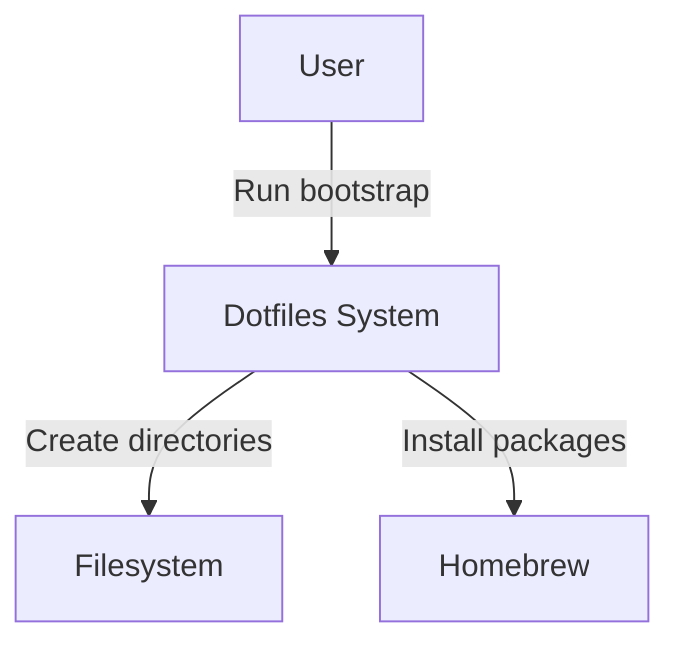

# Grounded C4: Concrete-First Architecture Modeling

**Version:** 1.0.0
**Date:** 2026-02-11
**Status:** Design Phase

---

## Table of Contents

1. [Introduction](#introduction)
2. [Why Grounded C4?](#why-grounded-c4)
3. [Core Concepts](#core-concepts)
4. [The Model](#the-model)
5. [YAML Format Reference](#yaml-format-reference)
6. [Validation Rules](#validation-rules)
7. [Integration with OpenSpec](#integration-with-openspec)
8. [Tool Usage](#tool-usage)
9. [Examples](#examples)
10. [Design Principles](#design-principles)

---

## Introduction

Grounded C4 is an architecture modeling approach that combines:
- **C4's progressive zoom** (Context → Container → Component → Code)
- **Ilograph's concrete modeling** (model real things, not abstractions)
- **Sequence diagrams** (runtime interactions)
- **State machines** (operational states)

The result is a unified model where structure, behavior, and code are traceable. One model, multiple views—all derived from machine-readable YAML definitions.

### Key Innovation

The critical innovation is **concrete-first modeling**: instead of classifying resources as "Container" or "Component" (which leads to taxonomy debates), you model *actual things* with *specific types*:

- ❌ "Database (Container)"
- ✅ "PostgreSQL RDS Instance (rds-postgresql)"

This makes the model more accurate, more queryable, and more useful for operations and cost analysis.

---

## Why Grounded C4?

### The C4 Problem

C4 is brilliant for communication—it's the closest thing to a lingua franca in software architecture. But it has friction points:

1. **Taxonomy Debate**: Is Redis a Container or a Component? Is a Lambda function a Container? Teams waste time classifying instead of modeling.

2. **Structure Without Behavior**: C4 shows *what exists* and *how it's nested*, but doesn't handle *how things interact over time* (sequences) or *what states a system can be in* (state machines). You maintain separate diagrams that drift.

### The Ilograph Insight

Ilograph's concrete modeling philosophy offers a solution: **stop abstracting, start naming things for what they are**. A PostgreSQL database is a PostgreSQL database. A Redis cache is a Redis cache. Compose them into higher-level groupings when helpful, but the concrete resources are always the foundation.

### The Grounded C4 Synthesis

Keep C4's progressive zoom (it's excellent for communication), but:
- Drop the prescribed taxonomy (Context/Container/Component/Code)
- Use concrete types (specific technologies, not abstract classifications)
- Add behavior modeling (sequences, state machines) as first-class citizens
- Integrate with OpenSpec (architecture lives alongside specs)

---

## Core Concepts

### Resources

A **resource** is a discrete thing in your system that provides value. Resources have:
- **id** - Unique identifier within parent scope
- **name** - Human-readable label
- **type** - Concrete, technology-specific type (e.g., `go-service`, `rds-postgresql`, `kafka-topic`)
- **abstract** - Flag indicating if this is a logical grouping (default: false)
- **technology** - Specific version/configuration metadata
- **interfaces** - How the resource can be reached
- **children** - Nested resources

**Example:**
```yaml
resources:
  - id: sessions-cache
    name: Sessions Cache
    type: elasticache-redis
    technology: Redis 7.2
    instance: cache.r7g.large
    interfaces:
      - id: cache-api
        protocol: redis
        direction: bidirectional
```

### Interfaces

An **interface** is a way to interact with a resource. Interfaces have:
- **id** - Unique identifier within the resource
- **protocol** - Communication protocol (https, grpc, kafka, websocket, redis, s3-api, etc.)
- **direction** - publish, subscribe, request-response, bidirectional, read, write
- **metadata** - Protocol-specific details (topic names, rate limits, latency)

**Why interfaces matter:**
- Relationships connect *interfaces*, not resources (forces precision)
- Different interfaces may have different protocols/characteristics
- Enables detailed integration specs

### Relationships

A **relationship** connects two interfaces. Relationships have:
- **from** - Source interface or resource
- **to** - Target interface or resource
- **via** - Optional intermediary (API gateway, event bus, load balancer)
- **description** - What this connection does

**Example:**
```yaml
relationships:
  - from: collaboration-service.session-manager
    to: sessions-cache.cache-api
    description: Session state read/write
```

### Sequences

A **sequence** models runtime interactions as ordered steps. Sequences have:
- **id** - Unique identifier
- **name** - Human-readable label
- **steps** - Ordered list of interactions

**Steps include:**
- from, to (resources or interfaces)
- action (what happens)
- condition (guard clause)
- note (documentation)
- parallel (concurrent steps)
- alt (alternative flows)

**Example:**
```yaml
sequences:
  - id: bootstrap-flow
    name: Bootstrap Installation Flow
    steps:
      - from: user
        to: bootstrap-script.cli
        action: Run script/bootstrap

      - from: bootstrap-script.xdg-setup
        to: filesystem
        action: Create XDG directories

      - from: bootstrap-script.brew-install
        to: homebrew.brew-api
        action: Install packages from all topics
```

### State Machines

A **state machine** captures operational states for a resource. State machines have:
- **resource** - Anchor to a specific resource
- **initial** - Starting state
- **states** - List of possible states
- **transitions** - How to move between states

**Transitions include:**
- from, to (state IDs)
- trigger (event that causes transition)
- guard (condition that must be true)
- action (side effect)
- sequence (reference to a sequence definition)

**Example:**
```yaml
state_machines:
  - id: bootstrap-lifecycle
    name: Bootstrap Script Lifecycle
    resource: dotfiles.bootstrap
    initial: not-run
    states:
      - id: not-run
        name: Not Run
      - id: running
        name: Running
      - id: complete
        name: Complete
    transitions:
      - from: not-run
        to: running
        trigger: user-invocation
        sequence: bootstrap-flow
      - from: running
        to: complete
        trigger: all-steps-pass
```

### Progressive Zoom

Unlike C4's fixed levels, zoom levels **emerge from your model's nesting**. For a typical system:

| Zoom Level | What You See | C4 Equivalent |
|------------|--------------|---------------|
| **Landscape** | Top-level systems + external actors | System Context |
| **Domain** | Abstract groupings + concrete children | ~Container |
| **Service** | Concrete resources + interfaces | ~Component |
| **Interface** | Protocols, directionality, metadata | (No C4 equivalent) |

The key difference: at every level, you see *real types*, not abstract classifications.

---

## The Model

### Resource Schema

```yaml
Resource:
  id: string                    # unique within parent scope
  name: string                  # human-readable
  type: string                  # concrete type identifier
  abstract: boolean             # default: false
  technology: string            # specific tech/version
  description: string
  tags: [string]
  metadata: {key: value}        # extensible
  interfaces: [Interface]
  children: [Resource]
  implementation: [CodeRef]     # links to code
```

### Interface Schema

```yaml
Interface:
  id: string
  protocol: string              # https, grpc, kafka, websocket, etc.
  direction: enum               # publish | subscribe | request-response |
                                #   bidirectional | read | write
  description: string
  metadata: {key: value}        # latency_p99, rate_limit, topic, etc.
```

### Relationship Schema

```yaml
Relationship:
  from: string                  # InterfaceRef or ResourceRef
  to: string                    # InterfaceRef or ResourceRef
  via: string                   # ResourceRef (intermediary)
  description: string
  tags: [string]
  metadata: {key: value}
```

**Path notation:**
- ResourceRef: `system.domain.service` (dotted path)
- InterfaceRef: `system.domain.service.interface-id` (resource path + interface id)

### Sequence Schema

```yaml
Sequence:
  id: string
  name: string
  description: string
  trigger: string
  steps: [Step]

Step:
  from: string                  # InterfaceRef or ResourceRef
  to: string                    # InterfaceRef or ResourceRef
  action: string
  condition: string             # guard
  note: string
  parallel: [Step]              # concurrent steps
  alt: [AlternativeBlock]       # alternative flows

AlternativeBlock:
  condition: string
  steps: [Step]
```

### State Machine Schema

```yaml
StateMachine:
  id: string
  name: string
  resource: string              # ResourceRef (anchors to structural model)
  initial: string               # StateId
  states: [State]
  transitions: [Transition]

State:
  id: string
  name: string
  description: string
  tags: [string]
  metadata: {key: value}

Transition:
  from: string                  # StateId
  to: string                    # StateId
  trigger: string
  guard: string
  action: string
  sequence: string              # SequenceId (links to sequence definition)
```

---

## YAML Format Reference

### Single-File Example

For small systems, use a single file:

```yaml
# architecture/dotfiles.yaml
resources:
  - id: dotfiles
    name: Dotfiles System
    type: system
    children:
      - id: bootstrap
        name: Bootstrap Script
        type: bash-script
        interfaces:
          - id: cli
            protocol: bash
            direction: request-response

relationships:
  - from: dotfiles.bootstrap.cli
    to: dotfiles.xdg-dirs
    description: Creates XDG directories

sequences:
  - id: bootstrap-flow
    name: Bootstrap Installation
    steps:
      - from: user
        to: dotfiles.bootstrap.cli
        action: Run script/bootstrap
```

### Multi-File Example (Fragments)

For large systems, split by concern:

```
architecture/
├── landscape.yaml              # Top-level systems + externals
├── resources/
│   ├── core.yaml              # Core resources
│   ├── infra.yaml             # Infrastructure
│   └── tools.yaml             # Tooling
├── sequences/
│   ├── bootstrap-flow.yaml
│   └── package-install.yaml
└── state-machines/
    └── bootstrap-lifecycle.yaml
```

Each fragment follows the same schema. The `arch` tool merges them on load.

---

## Validation Rules

A valid Grounded C4 model satisfies:

### 1. Referential Integrity

Every `InterfaceRef` and `ResourceRef` in relationships, sequences, and state machines MUST resolve to a resource or interface in the structural model.

**Example error:**
```
❌ Relationship references unknown interface: dotfiles.bootstrap.missing-interface
   File: resources/core.yaml, Line: 42
```

### 2. Unique IDs Within Scope

No two siblings MAY share an `id`. Full paths MUST be globally unique.

**Example error:**
```
❌ Duplicate resource ID: bootstrap
   First defined: resources/core.yaml, Line: 10
   Duplicate: resources/tools.yaml, Line: 15
```

### 3. Abstract Resources Have Children

An `abstract: true` resource MUST contain at least one child. Abstractions don't exist in isolation.

**Example error:**
```
❌ Abstract resource has no children: dotfiles.collaboration-domain
   File: resources/domains.yaml, Line: 23
```

### 4. State Machine Anchoring

Every state machine's `resource` field MUST point to a concrete (non-abstract) resource.

**Example error:**
```
❌ State machine anchored to abstract resource: dotfiles.collaboration-domain
   File: state-machines/collaboration-lifecycle.yaml, Line: 5
```

### 5. Sequence-Transition Linkage

If a transition's `sequence` field is set, the referenced sequence MUST exist.

**Example error:**
```
❌ Transition references unknown sequence: bootstrap-flow-v2
   File: state-machines/bootstrap-lifecycle.yaml, Line: 18
```

### 6. Orphan Interfaces (Warning)

Interfaces that appear in no relationship and no sequence are flagged for review.

**Example warning:**
```
⚠️  Unused interface: dotfiles.brew-manager.upgrade-api
   File: resources/tools.yaml, Line: 45
   Suggestion: Remove if truly unused
```

---

## Integration with OpenSpec

### Directory Structure

```
.openspec/
├── architecture/                  # Main architecture (current state)
│   ├── landscape.yaml
│   ├── resources/
│   ├── sequences/
│   ├── state-machines/
│   └── decisions/                # ADRs
│
├── changes/                       # Delta architecture (proposals)
│   └── add-feature/
│       ├── proposal.md
│       ├── specs/                # Delta specs
│       ├── tasks.md
│       └── architecture/         # Delta architecture
│
└── specs/                        # Behavioral specifications
    └── 001-dotfiles-core/
        └── spec.md               # Links to architecture
```

### Specs Reference Architecture

In a spec's requirement section, add an "Architecture:" subsection:

```markdown
### Requirement: XDG Base Directory Compliance

The system MUST follow XDG Base Directory Specification.

**Architecture:**
- Resources: `dotfiles.bootstrap.xdg-setup`, `dotfiles.xdg-config`
- Interfaces: `dotfiles.bootstrap.xdg-setup` (filesystem write)
- Sequences: `bootstrap-flow.yaml`

#### Scenario: Bootstrap Creates XDG Directories
...
```

### Architecture References Code

In a resource definition, add an `implementation` section:

```yaml
resources:
  - id: bootstrap
    name: Bootstrap Script
    type: bash-script
    repository: ~/.dotfiles/script/bootstrap
    implementation:
      - path: script/bootstrap
        lines: 53-73
        function: setup_xdg_dirs()
      - path: script/bootstrap
        lines: 23-26
        description: XDG environment variables
```

### Delta Architecture in Changes

When proposing a feature:

1. Create `.openspec/changes/[change-name]/`
2. Add `architecture/` subdirectory
3. Define new/modified resources with lifecycle markers (similar to delta specs)
4. On merge, fold into baseline architecture

---

## Tool Usage

### Commands

```bash
# Interactive browser (fzf-based, like spec)
arch

# List all resources
arch list

# Show system landscape
arch landscape

# Validate architecture model
arch validate

# Generate diagrams
arch diagram --format=mermaid --output=docs/architecture.md
arch diagram --zoom=landscape --format=mermaid
arch diagram --zoom=domain --format=mermaid

# Reverse engineer from codebase
arch reverse-engineer --source=script/
arch reverse-engineer --format=docker-compose --file=docker-compose.yml

# Check coverage (documented vs. actual)
arch coverage
arch coverage --source=script/

# Dependency analysis
arch deps <resource-id>
arch deps --upstream <resource-id>    # What depends on this
arch deps --downstream <resource-id>  # What does this depend on

# Impact analysis
arch impact <resource-id>             # If I change this, what's affected?

# ADR integration
arch adr <resource-id>                # Show related ADRs
```

### Output Examples

**`arch list`:**
```
📦 Dotfiles System (dotfiles)
├── 🔧 Bootstrap Script (bootstrap) [bash-script]
│   ├── Interface: cli (bash, request-response)
│   └── Interface: xdg-setup (filesystem, write)
├── 📁 XDG Directories (xdg-dirs) [filesystem]
└── 🍺 Homebrew Manager (brew-manager) [bash-script]
    └── Interface: brew-api (bash, request-response)

Total: 3 resources, 3 interfaces, 2 relationships
```

**`arch validate`:**
```
✅ Schema validation passed
✅ Referential integrity passed
⚠️  1 warning: Unused interface dotfiles.brew-manager.upgrade-api

Summary:
- Resources: 3
- Interfaces: 4
- Relationships: 2
- Sequences: 1
- State Machines: 1

✅ Architecture is valid
```

**`arch diagram --zoom=landscape --format=mermaid`:**


---

## Examples

### Example 1: Dotfiles System Architecture

**resources/core.yaml:**
```yaml
resources:
  - id: dotfiles
    name: Dotfiles System
    type: system
    description: Personal development environment management
    abstract: true
    children:
      - id: bootstrap
        name: Bootstrap Script
        type: bash-script
        technology: Bash 5.2
        repository: ~/.dotfiles/script/bootstrap
        implementation:
          - path: script/bootstrap
            lines: 53-73
            function: setup_xdg_dirs()
        interfaces:
          - id: cli
            protocol: bash
            direction: request-response
            description: Command-line invocation
          - id: xdg-setup
            protocol: filesystem
            direction: write
            description: Creates XDG directories

      - id: xdg-dirs
        name: XDG Directories
        type: filesystem
        description: XDG Base Directory structure
        interfaces:
          - id: config-dir
            protocol: filesystem
            direction: read-write
            metadata:
              path: ~/.config

      - id: brew-manager
        name: Homebrew Package Manager
        type: bash-script
        technology: Bash 5.2
        repository: ~/.dotfiles/homebrew/brew_install.sh
        interfaces:
          - id: brew-api
            protocol: bash
            direction: request-response

relationships:
  - from: dotfiles.bootstrap.xdg-setup
    to: dotfiles.xdg-dirs.config-dir
    description: Creates XDG_CONFIG_HOME directory

  - from: dotfiles.bootstrap
    to: dotfiles.brew-manager.brew-api
    description: Installs Homebrew packages from all topics
```

**sequences/bootstrap-flow.yaml:**
```yaml
sequences:
  - id: bootstrap-flow
    name: Bootstrap Installation Flow
    description: Full bootstrap process for new machine setup
    trigger: User runs script/bootstrap
    steps:
      - from: user
        to: dotfiles.bootstrap.cli
        action: Run script/bootstrap

      - from: dotfiles.bootstrap.xdg-setup
        to: dotfiles.xdg-dirs
        action: Create XDG directory structure

      - from: dotfiles.bootstrap
        to: dotfiles.brew-manager.brew-api
        action: Install Homebrew packages

      - from: dotfiles.bootstrap
        to: dotfiles.xdg-dirs.config-dir
        action: Symlink topic configs to XDG_CONFIG_HOME
```

**state-machines/bootstrap-lifecycle.yaml:**
```yaml
state_machines:
  - id: bootstrap-lifecycle
    name: Bootstrap Script Lifecycle
    resource: dotfiles.bootstrap
    initial: not-run
    states:
      - id: not-run
        name: Not Run
        description: Fresh machine, bootstrap has never run

      - id: running
        name: Running
        description: Bootstrap process in progress

      - id: complete
        name: Complete
        description: All steps completed successfully

      - id: failed
        name: Failed
        description: Bootstrap encountered errors

    transitions:
      - from: not-run
        to: running
        trigger: user-invocation
        action: Begin bootstrap process
        sequence: bootstrap-flow

      - from: running
        to: complete
        trigger: all-steps-pass
        action: Display success message

      - from: running
        to: failed
        trigger: step-error
        action: Display error message and rollback

      - from: failed
        to: running
        trigger: user-retry
        action: Retry from failed step
```

### Example 2: Microservices Architecture

**resources/services.yaml:**
```yaml
resources:
  - id: music-platform
    name: Music Platform
    type: system
    abstract: true
    children:
      - id: collab-service
        name: Collaboration Service
        type: go-service
        technology: Go 1.22
        repository: github.com/example/collab
        interfaces:
          - id: ws-connect
            protocol: websocket
            direction: bidirectional
            description: Client collaboration connection
          - id: session-events
            protocol: kafka
            topic: collab.sessions
            direction: publish

      - id: sessions-cache
        name: Sessions Cache
        type: elasticache-redis
        technology: Redis 7.2
        instance: cache.r7g.large
        interfaces:
          - id: cache-api
            protocol: redis
            direction: bidirectional

      - id: event-bus
        name: Event Bus
        type: msk-kafka
        technology: Kafka 3.5
        interfaces:
          - id: producer
            protocol: kafka
            direction: publish
          - id: consumer
            protocol: kafka
            direction: subscribe

relationships:
  - from: music-platform.collab-service.session-events
    to: music-platform.event-bus.producer
    description: Publish session events to Kafka

  - from: music-platform.collab-service
    to: music-platform.sessions-cache.cache-api
    description: Read/write session state
```

---

## Design Principles

1. **Concrete-First**: Model real things with real types. Abstractions are optional, flagged, and earned.

2. **Zoom, Don't Classify**: Nesting gives progressive disclosure. Levels emerge from structure, not taxonomy.

3. **Interfaces, Not Boxes**: Relationships connect specific interfaces with protocols—not vague arrows.

4. **Behavior Alongside Structure**: Sequences and state machines are peers of the resource model.

5. **Fragments Compose**: Each concern contributes a piece. Tooling merges and validates.

6. **Outputs are Projections**: Diagrams are views rendered from the model. The model is the source of truth.

7. **Decisions Travel with the Model**: ADRs reference resource IDs. Traceability is built in.

---

## Next Steps

1. **Implement Phase 1** (Core Modeling):
   - Define JSON schemas
   - Build `arch` CLI tool
   - Implement validation
   - Generate Mermaid diagrams

2. **Model Dotfiles Architecture**: Use the dotfiles system as proof-of-concept

3. **Integrate with Specs**: Link existing specs (001-dotfiles-core, 002-dotfiles-caching) to architecture

4. **Iterate**: Gather feedback and refine based on real-world usage

---

## References

- **C4 Model**: https://c4model.com/
- **Ilograph**: https://www.ilograph.com/
- **Mermaid**: https://mermaid.js.org/
- **OpenSpec**: https://github.com/Fission-AI/OpenSpec
- **RFC 2119**: https://datatracker.ietf.org/doc/html/rfc2119

---

**License:** Apache-2.0
**Copyright:** 2026 Ilja Heitlager
**Co-Authored-By:** Claude Sonnet 4.5 <noreply@anthropic.com>
